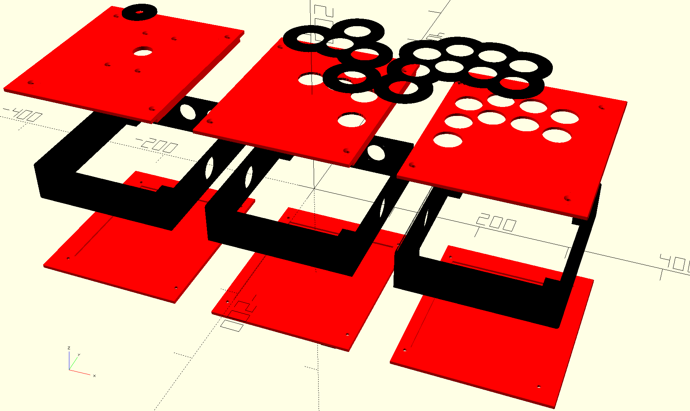

# The Buildable Stick System

Files for 3D printing an arcade stick.

Originally an attempt to make a couple customized STL files for the [OpenStickCommunity Fightstick
Case](https://github.com/OpenStickCommunity/Hardware/tree/main/Fightstick%20Case), the changes ballooned to fit my
design and became incompatible with that project's components. This should be considered a different project with some
similar DNA, but to stress again, it could not have been done without that project as a guide star. See **Attribution**.

## Designing

No particular arcade stick design is prescribed by this project, instead, SCAD files are provided to choose desired
component objects or create new ones. The OpenSCAD language is essentially a functional programming language, making it
it easy to reuse, alter, and compose objects. If you do not see the object you would like, you can likely create it by
starting with an existing object and constructing what you'd like with new or existing components.

## Printing

These items all fit on a 256mm^2 print bed; I use a Bambu Lab P1P based on what I've learned from the
OpenStickCommunity. Standard settings seem sufficiently sturdy for my purposes, though the slicer has done a couple
weird things, in my experience.

## Assembling

What you'll need beyond these objects:

* An arcade stick board (I recommend [TheTrain's RP2040 Advanced Breakout
  Board](https://github.com/OpenStickCommunity/Hardware/tree/main/RP2040%20Advanced%20Breakout%20Board))
    * 4 M3 8mm hex bolts to secure the PCB to a panel
* Per frame and plate combo:
    * 4 40mm M4 hex brass standoffs
    * 8 12-16mm M4 countersunk hex bolts
* Per frame connection point:
    * 8 16mm M4 bolts
    * 8 M4 flange nuts
* For a lever:
    * 4 12-16mm M4 countersunk hex bolts
    * 4 M4 flange nuts
* Buttons and levers as desired
* Wiring as required

### Issues and Limitations

This is a living repository, and as such, there are likely issues with the objects, known or otherwise.
These issues may be fixed in the future; see `TODO.md` for details.

## Development and Contributing

Improvements, variants, new layouts, novel ideas, and etc. are all welcome.

These files are suitable for previewing and rendering in OpenSCAD. They may also work in FreeCAD and perhaps other
software, but they are developed in OpenSCAD, so YMMV otherwise.

## Attribution

Inspired by the incredible work of [TheTrain](https://github.com/TheTrainGoes) on the [OpenStickCommunity Fightstick
Case](https://github.com/OpenStickCommunity/Hardware/tree/main/Fightstick%20Case), itself based on the incredible work
by [Dash n'Mash](https://twitter.com/Dash_xx_Mash?s=20). Original work Copyright 2023 TheTrain, [licensed under CC BY
4.0](https://creativecommons.org/licenses/by/4.0/).

Made possible by the amazing efforts of [slagcoin](https://www.slagcoin.com/).

## Author and Licensing

Written by and copyright Brian S. Stephan (<bss@incorporeal.org>).

The Buildable Stick System is free software: you can redistribute it and/or modify it under the terms of the GNU General Public
License as published by the Free Software Foundation, either version 3 of the License, or (at your option) any later
version.

The Buildable Stick System is distributed in the hope that it will be useful, but WITHOUT ANY WARRANTY; without even the implied
warranty of MERCHANTABILITY or FITNESS FOR A PARTICULAR PURPOSE. See the GNU General Public License for more details.

You should have received a copy of the GNU General Public License along with the Buildable Stick System. If not, see
<https://www.gnu.org/licenses/>.
